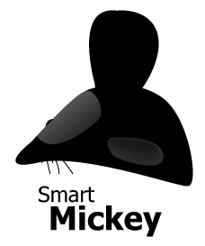

Mickey.js
=========

Mouses are smarter these days! A handy tool that makes it easy to play with mouses.
Mickey is still a work in progress, so it might have many issues, we'll be glad if you report them.
View examples here: [Mickey.js](http://mahdi-.github.io/Mickey.js/)

Download minified version for production: [Mickey-0.1.min.js](https://raw.github.com/Mahdi-/Mickey.js/master/Mickey-0.1.min.js)

Clone Mickey's repo:

	$ git clone https://github.com/Mahdi-/Mickey.js.git

Why Mickey?
===========
<ul>
<li>No dependecy</li>
<li>jQuery-like API</li>
<li>Event-based</li>
<li>Easy to use</li>
</ul>

API
===

Mickey.js has a jQuery-like chained API. Mickey uses `document.querySelectorAll()` to parse selectors, so you have to separate selectors with commas, take a look:

	Mickey('button, .s').blink(200);

Here is a list of Mickey's functions:

**Mickey( selector )**

Needs an argument `selector` which is one or more CSS Selector(s) or an HTML Element Object.

**.blink( delay, cursor )**

Has two optional arguments `delay` and `cursor`. The cursor blinks with a `delay`, if you wan't to specify the cursor to be blinked, add `cursor`.

Defaults values:

	delay = 300
	cursor = 'default'

**.timeout( cursor, delay, revert )**

Has three optional arguments `cursor`, `delay` and `revert`. The current cursor changes to `cursor` after a `delay`, if `revert` is not null or undefined, the cursor changes back to what it was.

Default values:

	cursor = 'pointer'
	delay = 300
	revert = undefined

**.interval( from, to, delay )**

Has one optional argument `delay` and two must-be-specified arguments `from` and `to`. The cursor changes from `from` to `to` with a `delay` and repeats.

Default values:

	delay = 300

<b>.shadow( x, y, color, delay, effect, className )</b>

Has 6 optional arguments `x`, `y`, `color`, `delay`, `effect` and `id`. Adds a shadow to cursor, placed at right-bottom of the cursor, `x` and `y` are relative positions to shadow's place and cannot be less than 0, `color` specifies shadow's color and `delay` specifies the delay that shadow has to answer to mouse's move, `effect` is an object containing effect's info[[effects](https://github.com/Mahdi-/Mickey.js/#effects)], and `className` specifies the `class` attribute gave to the shadow.

Default values:

	x = 0
	y = 0
	color = 'black'
	delay = 0
	className = undefined

[Effects](https://github.com/Mahdi-/Mickey.js/#effects)

**.text( text, styles, x, y, effect, className )**

Has 5 optional arguments `styles`, `x`, `y`, `effect` and `className` and a must-be-specified argument `text`. Adds a `text` that follows the cursor at it's right-bottom corner by default, relative position of text can be changed using `x` and `y`, CSS styles of the text can be specified using an object of styles as `styles` argument, can have different `effect`s[[effects](https://github.com/Mahdi-/Mickey.js/#effects)] and the text's `class` attribute is specified using `className` argument.

Defaullt values:

	styles = undefined
	x = 0
	y = 0
	effect = undefined
	className = undefined

Built-in effects available:

	heartbeat

[Effects](https://github.com/Mahdi-/Mickey.js/#effects)

**.image( src, styles, x, y, effect, className )**

Same as `.text( .. )`, with a difference of `src` instead of `text`.

Default values:

	styles = undefined
	x = 0
	y = 0
	effect = undefined
	className = undefined

Built-in effects available:

	spin

[Effects](https://github.com/Mahdi-/Mickey.js/#effects)

**.chase()**

Has no arguments. Calling this function forces scrolls to chase the mouse.

**.absolute()**

Has no argument, returns an object of mouse's current position with two properties `top` and `left`.

**.relative()**

Has no argument, returns an object of mouse's current position, relative to selector defined in `Mickey( .. )` with two properties `top` and `left`.

**.hover( function )**

Needs a function as first argument to be called on `mouseover` event.

**.click( function )**

Needs a function as first argument to be called on `click` event.

**.remove( object )**

Needs an object as first argument, this is used to remove EventListeners, take a look at example:

	var x = Mickey().chase();
	Mickey().stop( x );

When you `.stop` an object, for example, let's say, `.blink`, the `.blink` is not stopped in the elements it started from, it stops in the elements specified in `Mickey()`:

	var b = Mickey('.foo, #test').blink();

`.blink` was called on `.foo` and `#test`. But when you do this:

	Mickey('.foo').stop( b );

The `#test` still blinks!

**NOTE: This feature works on `.blink`, `.interval`, `.timeout`, `.image`, `.text`, `.shadow`, `.hover` and `.click`**

Effects
=======

We made it easy to make effects for Mickey.
All you have to do is to make a function and assign it to `Mickey.effects` object that has 3 properties `text`,`shadow` and `image`, your function takes an array of elements as argument, for example, text effects, take the `span` elements as their first argument, and other properties as second argument.
Use `Mickey.forEach( elementsArray, function( element ) )` to loop over elements, it's safe and easy.

	Mickey(selector).text(..,..,..,.., { name : 'effectName', option1 : 'foo' })

Effects should be in an external file and placed in `/effects` folder.

Example:

	Mickey.effects.text.youreffectname = function( els, opts ) {
	  Mickey.forEach( els, function( el ) {
	    //Your code
	  });
	};

That's all, Mickey loops over effects and tries to find the effect that user has called.

Effects available:

	text:
	     heartbeat
	
	image:
	      spin

Third-party effects:

	none yet :(

TODO
====

Mickey has a long way to go, but these spotted bugs are in priority:

[Issue #1](https://github.com/Mahdi-/Mickey.js/issues/1)

[Issue #2](https://github.com/Mahdi-/Mickey.js/issues/2)

[Issue #3](https://github.com/Mahdi-/Mickey.js/issues/3)

License
=======

Mickey is published under [MIT LICENSE](http://opensource.org/licenses/MIT).

The MIT License (MIT)

Copyright 2013 Mahdi Dibaiee

Permission is hereby granted, free of charge, to any person obtaining a copy
of this software and associated documentation files (the "Software"), to deal
in the Software without restriction, including without limitation the rights
to use, copy, modify, merge, publish, distribute, sublicense, and/or sell
copies of the Software, and to permit persons to whom the Software is
furnished to do so, subject to the following conditions:

The above copyright notice and this permission notice shall be included in
all copies or substantial portions of the Software.

THE SOFTWARE IS PROVIDED "AS IS", WITHOUT WARRANTY OF ANY KIND, EXPRESS OR
IMPLIED, INCLUDING BUT NOT LIMITED TO THE WARRANTIES OF MERCHANTABILITY,
FITNESS FOR A PARTICULAR PURPOSE AND NONINFRINGEMENT. IN NO EVENT SHALL THE
AUTHORS OR COPYRIGHT HOLDERS BE LIABLE FOR ANY CLAIM, DAMAGES OR OTHER
LIABILITY, WHETHER IN AN ACTION OF CONTRACT, TORT OR OTHERWISE, ARISING FROM,
OUT OF OR IN CONNECTION WITH THE SOFTWARE OR THE USE OR OTHER DEALINGS IN
THE SOFTWARE.
